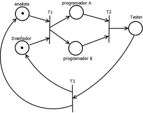

# Tarea 3 de Lenguajes de programación, "redes de petri"

## Descripción
Tarea del ramo Lenguajes de programación en donde consiste implementar un programa usando hilos o hebras. Dicha tarea consiste en realizar una simulación de desarrollo de software usando redes de petri que es una topología de un sistema distribuído y concurrente y representa un sistema básico de autómatas.
Esta simulación, como se muestra en la imagen inferior, está compuesto de un diseñador (D), un analista (A), dos programadores (P), y un tester o QA (T), en donde el diseñador (D) y el analista (A) trabajan concurrentemente y una vez terminado su trabajo, los programadores (P) trabajan concurrentemente, una vez terminado de programar, el tester (T) empieza a revisar el trabajo realizado por los programadores (P) en la cual siempre encuentra fallas y debe pasar nuevamente el proyecto al diseñador (D) y al analista (A) repitiendo el ciclo de manera indefinida.



## Requerimientos
- python 3.6 (probado con python 3.8)

## Uso

1. Descargar o clonar repositorio
```bash
git clone http://github.com/dani93t/tarea3LP
```
2. ejecutar
```bash
python petri.py
```
Si tiene Python en su PATH, ingresa
```bash
petri.py
```
## Registro de Cambios
* (18-03-2021)
    * encapsulación a clase del proyecto
    * mejoras en README.md


## Referencias
* Gandra, M. (2013). Redes de petri: definicion, formalización y ejecución. Universidad de Cantabria. https://www.ctr.unican.es/asignaturas/MC_ProCon/Doc/PETRI_1.pdf
* Wikipedia. (2020, 26 diciembre). Red de Petri. Wikipedia, la enciclopedia libre. https://es.wikipedia.org/wiki/Red_de_Petri